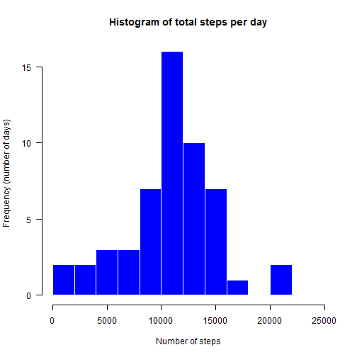
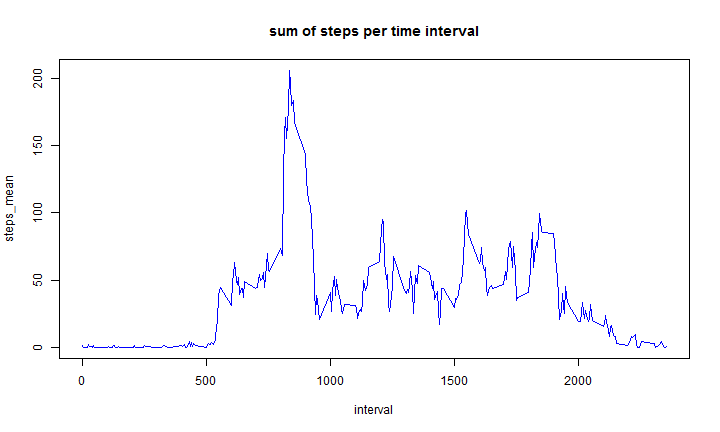
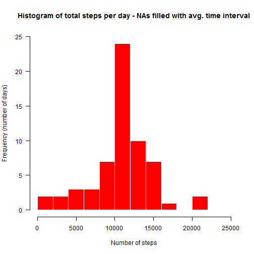
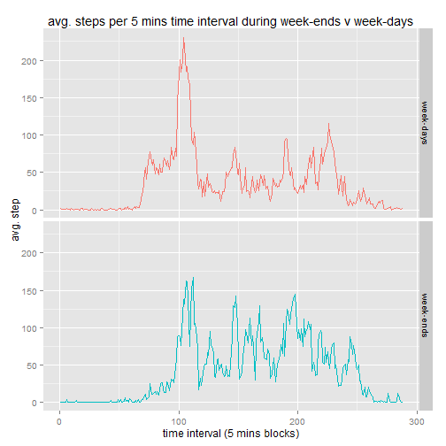

## Objective and sources:
This assignment makes use of data from a personal activity monitoring device. This device collects data at 5 minute intervals through out the day. The data consists of two months of data from an anonymous individual collected during the months of October and November, 2012 and include the number of steps taken in 5 minute intervals each day.

The data for this assignment can be downloaded from the course web site:
Dataset: Activity monitoring data [52K]
The variables included in this dataset are:

* steps: Number of steps taking in a 5-minute interval (missing values are coded as NA)

* date: The date on which the measurement was taken in YYYY-MM-DD format

* interval: Identifier for the 5-minute interval in which measurement was taken

The dataset is stored in a comma-separated-value (CSV) file and there are a total of 17,568 observations in this dataset.

## Report writing and analitical work:

Need to read the csv first using:

```r
activity <- read.csv("activity.csv", header = TRUE, sep = ",", quote = "\"" , na.strings = "NA")
```


After, we need to process dates to enable plotting histogram later

```r
activity$date <- as.Date(as.character(activity$date))
```

Now upload the R packages we will use in the course of the anaylsis. 


```r
require(dplyr)
```

```
## Loading required package: dplyr
## 
## Attaching package: 'dplyr'
## 
## The following objects are masked from 'package:stats':
## 
##     filter, lag
## 
## The following objects are masked from 'package:base':
## 
##     intersect, setdiff, setequal, union
```

```r
require(ggplot2)
```

```
## Loading required package: ggplot2
```

### What is mean total number of steps taken per day?

To answer that we first need to prepare a table the summarises the info and then create a histogram 


```r
total_steps_day <-  activity %>%
                    group_by(date) %>%
                    summarise(total = sum(steps)) 
#with na.rm active the sum funciton will fill NA with 0: I decided not to activate it.

hist(total_steps_day$total, 
     main="Histogram of total steps per day",
     xlab="Number of steps",
     ylab="Frequency (number of days)",
     border="white",
     col="blue",
     xlim=c(0,25000),
     las=1,
     breaks=10)
```

 

After we can calculate the mean and median step taken per day

```r
total_steps_avg <-  total_steps_day %>%
                    summarise (mean = mean (total, na.rm =TRUE),
                    median = median(total, na.rm =TRUE))

print(total_steps_avg)
```

```
## Source: local data frame [1 x 2]
## 
##       mean median
##      (dbl)  (int)
## 1 10766.19  10765
```

### What is the average daily activity pattern?
prepare a summary of info needed and then plot the line that describes avg. steps taken per time interval of all days. Time intervals are 5 minutes long and you can read for example 0005 as 00:05, 0130 as 1:30 and so on every 5 minutes.


```r
question2 <-  activity %>%
              group_by(interval)%>%
              summarise(steps_mean = mean(steps, na.rm =TRUE))

with(question2, plot(interval, steps_mean, main="sum of steps per time interval", type="l", col="blue"))
```

 

```r
question2a <- arrange(question2, desc(steps_mean))
print(question2a[1, ])
```

```
## Source: local data frame [1 x 2]
## 
##   interval steps_mean
##      (int)      (dbl)
## 1      835   206.1698
```
The time interval with highest avg. steps taken is between 8:35AM and 8:40AM


### Imputing missing values

To calculate NAs in dataset, I use R summary() function


```r
print(summary(activity))
```

```
##      steps             date               interval     
##  Min.   :  0.00   Min.   :2012-10-01   Min.   :   0.0  
##  1st Qu.:  0.00   1st Qu.:2012-10-16   1st Qu.: 588.8  
##  Median :  0.00   Median :2012-10-31   Median :1177.5  
##  Mean   : 37.38   Mean   :2012-10-31   Mean   :1177.5  
##  3rd Qu.: 12.00   3rd Qu.:2012-11-15   3rd Qu.:1766.2  
##  Max.   :806.00   Max.   :2012-11-30   Max.   :2355.0  
##  NA's   :2304
```

There are 2304 NAs.

I admit using the forum for the next step! 
First duplicate step column, convert interval to factor, then find NAs, then find interval values which need filling, finally fill where NA is true.


```r
new_activity <- activity
new_activity$interval <- as.factor(new_activity$interval)
new_activity$steps2 <- new_activity$steps
  ind <- is.na(new_activity$steps2)
  ints <- (new_activity$interval[ind])
  new_activity$steps2[ind] <- question2$steps_mean[ints]
```

Re-cylce code and date from first part of assignmet, this time using steps2 for graph and calculations

```r
total_steps_day2 <-  new_activity %>%
    group_by(date) %>%
    summarise(total = sum(steps2)) 

    hist(total_steps_day2$total, 
       main="Histogram of total steps per day - NAs filled with avg. time interval",
       xlab="Number of steps",
       ylab="Frequency (number of days)",
       border="white",
       col="red",
       xlim=c(0,25000),
       ylim=c(0,25),
       las=1,
       breaks=10)
```

 

```r
total_steps_avg2 <-  total_steps_day2 %>%
    summarise (mean = mean (total, na.rm =TRUE),
               median = median(total, na.rm =TRUE))
print(total_steps_avg2)
```

```
## Source: local data frame [1 x 2]
## 
##       mean   median
##      (dbl)    (dbl)
## 1 10766.19 10766.19
```

We see that values with imputing filligs for NAs differ from first part of the assignment. However, the difference in total mean and median is not substantial.

### Are there differences in activity patterns between weekdays and weekends?
we first need to add one column specifying the factor weekend or weekday.
Here you will see "sabato" "Domenica" which are the Italian for "Saturday" and "Sunday" respectively"
After, we can plot the lines reflecting this factor on two different panels.


```r
new_activity$weekend <- as.factor(ifelse(weekdays(new_activity$date) %in% c("domenica", "sabato"), "week-ends", "week-days"))

split_panels <-  new_activity %>%
  group_by(weekend, interval) %>%
  summarise(mean_steps2 = mean(steps2))

split_panels$interval <- as.numeric(split_panels$interval)

require(ggplot2)

g <-  ggplot(split_panels, aes(interval, mean_steps2, color=weekend)) +
      geom_line() +
      facet_grid(weekend ~ .) +
      ggtitle("avg. steps per 5 mins time interval during week-ends v week-days") + 
      xlab("time interval (5 mins blocks)") + 
      ylab("avg. step") +
      theme(legend.position="none")
print(g)
```

 

The panel view show that during week-day more steps are taken on average.
